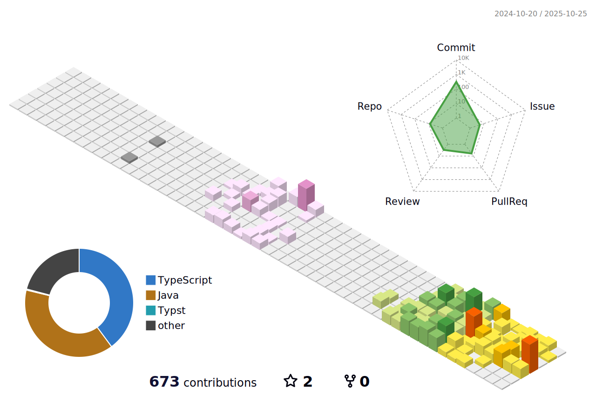

  
  

  

<h1 align="center">Hey there 👋</h1>

<h3 align="left">👨‍💻 About Me</h3>

  Hi, I'm <strong>Yunfeng Long</strong> from <strong>Guangzhou (广州)</strong>, China!  
  - 🔭 A <strong>Computer Science</strong> student at <strong>Monash University</strong>, passionate about creating <strong>scalable software solutions</strong>.  
  - 📚 Currently diving into <strong>advanced algorithms</strong>, <strong>data structures</strong>, and their practical applications.  
  - ⚡ In my free time, I enjoy competing in <strong>programming contests</strong> (top 25% in <strong>CCC '22</strong>) and building projects with <strong>REST APIs</strong> and <strong>UI design</strong>.

<h3 align="left">🛠 Languages and Tools</h3>

  
  
  
  
  
  
  
  
  
  
  
  
  
  
  

<h3 align="left">🔥 My Stats</h3>

  

<!-- 

  

 -->

  

